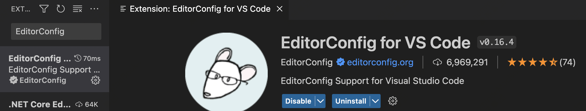
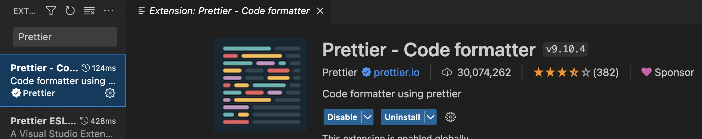
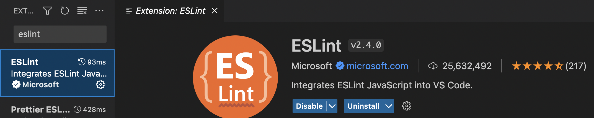
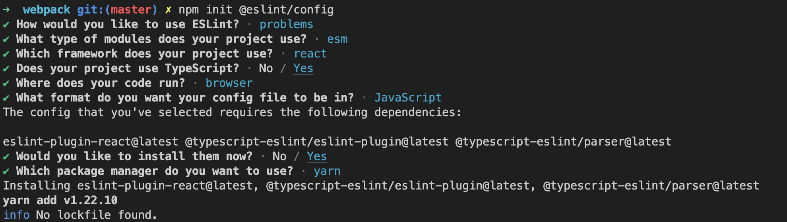
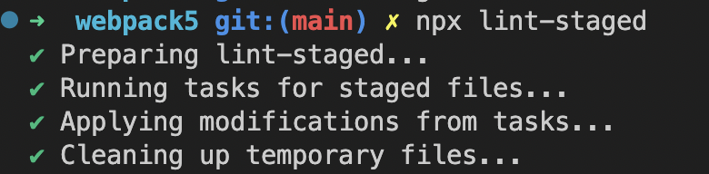
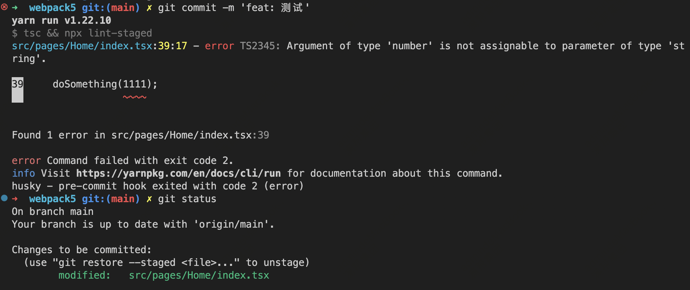
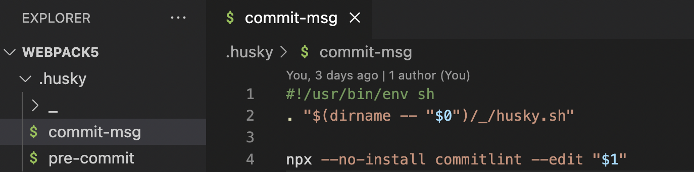
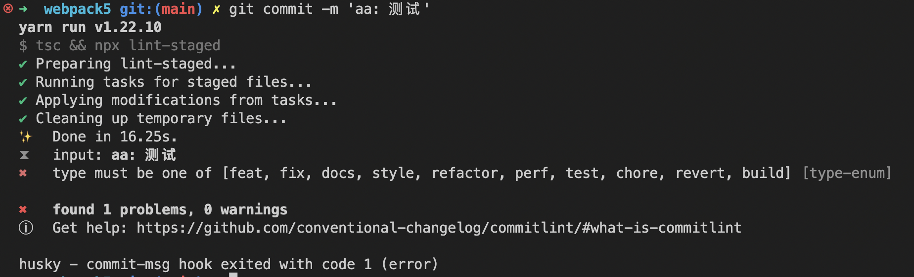
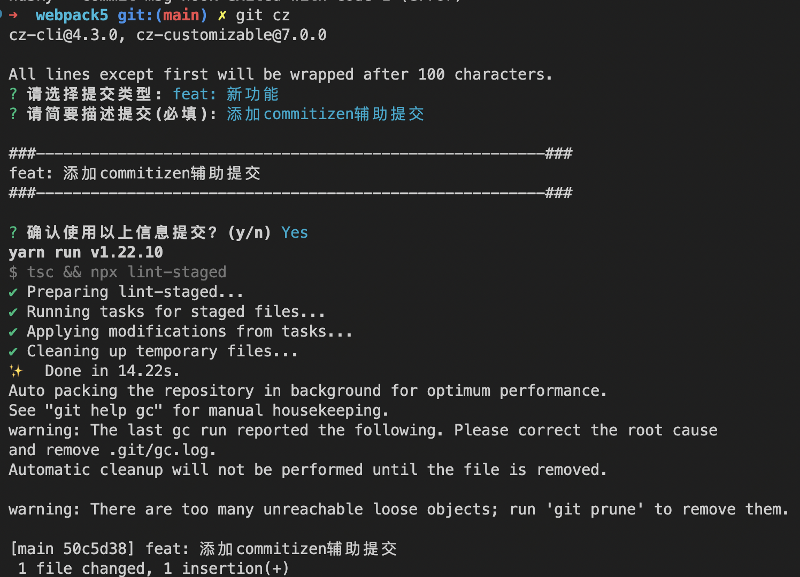
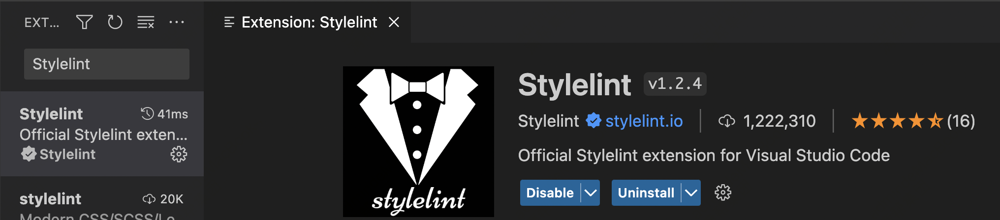

---
nav:
  title: 博客
  order: 2
group:
  title: 前端工程化
  order: 1
title: 代码格式化
description: 代码格式化
order: 6
---

## 一. editorconfig统一编辑器配置
由于每个人的vsocde编辑器默认配置可能不一样，比如有的默认缩进是4个空格，有的是2个空格，如果自己编辑器和项目代码缩进不一样，会给开发和项目代码规范带来一定影响，所以需要在项目中为编辑器配置下格式。
### 1.1 安装vscode插件EditorConfig
打开vsocde插件商店，搜索`EditorConfig for VS Code`，然后进行安装。

### 1.2 添加.editorconfig配置文件
安装插件后，在根目录新增 __.editorconfig__ 配置文件:
```
root = true # 控制配置文件 .editorconfig 是否生效的字段
​
[**] # 匹配全部文件
indent_style = space # 缩进风格，可选space｜tab
indent_size = 2 # 缩进的空格数
charset = utf-8 # 设置字符集
trim_trailing_whitespace = true # 删除一行中的前后空格
insert_final_newline = true # 设为true表示使文件以一个空白行结尾
end_of_line = lf
​
[**.md] # 匹配md文件
trim_trailing_whitespace = false
```
上面的配置可以规范本项目中文件的缩进风格，和缩进空格数等，会覆盖vscode的配置，来达到不同编辑器中代码默认行为一致的作用。
## 二.prettier自动格式化代码
每个人写代码的风格习惯不一样，比如代码换行，结尾是否带分号，单双引号，缩进等，所以需要`prettier`来帮我们自动格式化代码。
### 2.1 安装vscode插件Prettier
打开vsocde插件商店，搜`Prettier - Code formatter`，然后进行安装。

### 2.2 添加 .prettierrc.js 配置文件。
安装插件后，在根目录新增 __.prettierrc.js__ 配置文件，配置内容如下：
```
module.exports = {
  printWidth: 100, // 一行的字符数，如果超过会进行换行
  tabWidth: 2, // 一个tab代表几个空格数，默认就是2
  useTabs: false, // 是否启用tab取代空格符缩进，.editorconfig设置空格缩进，所以设置为false
  singleQuote: true, // 字符串是否使用单引号
  trailingComma: 'none', // 对象或数组末尾是否添加逗号 none| es5| all
  jsxSingleQuote: true, // 在jsx里是否使用单引号，你看着办
  bracketSpacing: true, // 对象大括号直接是否有空格，默认为true，效果：{ foo: bar }
  arrowParens: 'avoid' // 箭头函数如果只有一个参数则省略括号
};
```
### 2.3 添加.vscode/settings.json
配置前两步后，虽然已经配置prettier格式化规则，但还需要让vscode来支持保存后触发格式化
在项目根目录新建 .vscode文件夹，内部新建settings.json文件配置文件，内容如下：
```
{
  "search.exclude": {
   "/node_modules": true,
   "dist": true,
  },
  "editor.formatOnSave": true,
  "[javascript]": {
   "editor.defaultFormatter": "esbenp.prettier-vscode"
  },
  "[javascriptreact]": {
   "editor.defaultFormatter": "esbenp.prettier-vscode"
  },
  "[typescript]": {
   "editor.defaultFormatter": "esbenp.prettier-vscode"
  },
  "[typescriptreact]": {
   "editor.defaultFormatter": "esbenp.prettier-vscode"
  },
  "[json]": {
   "editor.defaultFormatter": "vscode.json-language-features"
  },
  "[html]": {
   "editor.defaultFormatter": "esbenp.prettier-vscode"
  },
  "[markdown]": {
   "editor.defaultFormatter": "esbenp.prettier-vscode"
  },
  "[css]": {
    "editor.defaultFormatter": "esbenp.prettier-vscode"
  },
  "[less]": {
    "editor.defaultFormatter": "esbenp.prettier-vscode"
  },
  "[scss]": {
    "editor.defaultFormatter": "esbenp.prettier-vscode"
  }
}
```
先配置了忽略哪些文件不进行格式化，又添加了保存代码后触发格式化代码配置，以及各类型文件格式化使用的格式。
这一步配置完成后，修改项目代码，把格式打乱，点击保存时就会看到编辑器自动把代码格式规范化了。
## 三.eslint+lint-staged检测代码
### 3.1 安装vscode插件ESLint
打开vsocde插件商店，搜索ESLint，然后进行安装。

### 3.2 安装eslint依赖
```
yarn add eslint -D
```
### 3.3 配置.eslintrc.js文件
安装eslint后，执行`npm init @eslint/config`，选择自己需要的配置

这里我们选择了
* 使用eslint检测并问题
* 项目使用的模块规范是es module
* 使用的框架是react
* 使用了typescript
* 代码选择运行在浏览器端
* eslint配置文件使用js格式
* 是否现在安装相关依赖，选择是
* 使用yarn包管理器安装依赖
选择完成后会在根目录下生成 .eslint.js文件，默认配置如下

生产完之后,因为react 18 使用jsx 语法可以不再引入React,但是不引入eslint仍然会报错，所以在eslint配置文件 __.eslint.js__ 的extends字段添加插件`plugin:react/jsx-runtime`。

__.eslintec.js__ 文件也有红色报错，报错是 'module' is not defined.
这个是因为上面选择的浏览器环境，配置文件的module.exports需要node环境，需要在eslint的env环境配置中添加支持node环境。
最后文件如下,rules中的配置根据自己的需要设置。
```
module.exports = {
  env: {
    // 保证各种引入方式不报错
    browser: true,
    es2021: true,
    node: true,
    commonjs: true,
    amd: true
  },
  extends: [
    'eslint:recommended',
    'plugin:react/recommended',
    'plugin:@typescript-eslint/recommended',
    'plugin:react/jsx-runtime'
  ],
  overrides: [],
  settings: {
    react: {
      version: 'detect'
    }
  },
  parser: '@typescript-eslint/parser',
  parserOptions: {
    ecmaFeatures: {
      jsx: true
    },
    ecmaVersion: 'latest',
    sourceType: 'module'
  },
  plugins: ['react', '@typescript-eslint'],
  rules: {
    'react/jsx-uses-react': 'off', // 关闭必须引入React
    'react/react-in-jsx-scope': 'off',
    '@typescript-eslint/no-var-requires': 0, // 可以使用require引入
    '@typescript-eslint/no-non-null-assertion': 'off',
    '@typescript-eslint/no-explicit-any': 'off'
  }
};

```
### 3.4 使用lint-staged优化eslint检测
在实际开发过程中，为了缩短检查时间以及不检测没必要的文件，我们通常只检查提交到暂存区的文件,git add添加的文件。我们通过`lint-staged`来帮我们实现。
```
yarn add lint-staged -D
```
修改package.json脚本eslint的配置。lint-staged默认只有检测到eslint语法报错才会阻止代码提交，如果想有警告时也阻止代码提交，需要给eslint检测配置参数 --max-warnings=0。
```
  "scripts": {
    "eslint": "eslint --max-warnings=0",
  }
```
在package.json添加lint-staged配置
```
  "lint-staged": {
    "src/**/*.{ts,tsx}": [
      "yarn run eslint"
    ],
  },
```
当执行 `npx lint-staged`,就会检测添加到暂存区的文件是否有语法问题。

## 四.使用tsc检测类型和报错
在项目中使用了ts,但一些类型问题，现在配置的eslint是检测不出来的，需要使用ts提供的tsc工具进行检测。
```
"pre-check": "tsc && npx lint-staged"
```
执行yarn run pre-check，发现已经可以检测出类型报错了。

## 五.项目git提交时检测语法规范
为了避免把不规范的代码提交到远程仓库，一般会在git提交代码时对代码语法进行检测，只有检测通过时才能被提交，git提供了一系列的githooks ，而我们需要其中的 __pre-commit__钩子，它会在git commit把代码提交到本地仓库之前执行，可以在这个阶段检测代码，如果检测不通过就退出命令行进程停止commit。
### 5.1 代码提交前husky检测语法
1. 通过husky监听githooks。
```
yarn add husky -D
```
2. 配置husky的 __pre-commit__ 钩子
生成 .husky配置文件夹（如果项目中没有初始化git,需要先执行git init）
```
npx husky install
```
使husky监听pre-commit钩子，监听到后执行上面定义的`yarn run pre-check`语法检测。
```
npx husky add .husky/pre-commit 'npm run pre-check'
```
会在 .husky目录下生成pre-commit文件，里面可以看到我们设置的`yarn run pre-check`命令。
```
#!/usr/bin/env sh
. "$(dirname -- "$0")/_/husky.sh"

yarn run pre-check
```
可以看到提交的时候监听了pre-commit钩子执行了yarn run pre-check, 使用eslint检测了git暂存区的文件，并且发现了home.tsx的警告，退出了命令行，没有执行git commit把暂存区代码提交到本地仓库。

## 六.代码提交时检测commit备注规范
为了在多人开发中其他人能理解本次提交修改的大致内容，方便维护迭代。我们可以使用githooks 中`commit-msg`在commit 之前获取到commit备注，通过这个钩子来验证备注是否合理。而验证的规范就是通过 `commitlint`来定义。
### 6.1 安装和配置commitlint
```
yarn add @commitlint/config-conventional @commitlint/cli -D
```
在根目录创建 __commitlint.config.js__ 文件,添加配置如下
```
module.exports = {
  // 继承的规则
  extends: ['@commitlint/config-conventional'],
  // 定义规则类型
  rules: {
    // type 类型定义，表示 git 提交的 type 必须在以下类型范围内
    'type-enum': [
      2,
      'always',
      [
        'feat', // 新功能 feature
        'fix', // 修复 bug
        'docs', // 文档注释
        'style', // 代码格式(不影响代码运行的变动)
        'refactor', // 重构(既不增加新功能，也不是修复bug)
        'perf', // 性能优化
        'test', // 增加测试
        'chore', // 构建过程或辅助工具的变动
        'revert', // 回退
        'build' // 打包
      ]
    ],
    // subject 大小写不做校验
    'subject-case': [0],
    'type-case': [0],
    'type-empty': [0],
    'scope-empty': [0],
    'scope-case': [0],
    'subject-full-stop': [0, 'never'],
    'header-max-length': [0, 'always', 72]
  }
};
```
### 6.2 配置husky监听commit-msg
让husky监听 __commit-msg__ 钩子，在钩子函数中使用`commitlint`来验证。
```
npx husky add .husky/commit-msg 'npx --no-install commitlint --edit "$1"'
```
会在 __.husky__ 目录下生成 __commit-msg__ 文件，并且配置 `commitlint`命令对备注进行验证配置。

再次执行`git commit -m "aa:测试"`,可以看到commit失败，并给出了提示。

修改成`git commit -m "feat:测试"`就可以提交成功了。
## 七.添加git commit辅助备注信息
我们可以借助 `commitizen` 来添加辅助信息，使我们提交代码的时候做选择，会方便很多。
### 7.1 安装commitizen
全局安装commitizen，否则无法执行插件的`git cz`命令：
```
npm i commitizen -g
```
在项目内安装cz-customizable：
```
yarn add cz-customizable -D
```
### 7.2 配置commitizen自定义提示规则
添加以下配置到 __package.json__ 中：
```
"config": {
    "commitizen": {
        "path": "./node_modules/cz-customizable"
    }
}
```
在根目录创建 __.cz-config.js__ 自定义提示文件：
```
module.exports = {
  // 可选类型，和上面commitlint.config.js配置的规则一一对应
  types: [
    { value: 'feat', name: 'feat: 新功能' },
    { value: 'fix', name: 'fix: 修复' },
    { value: 'docs', name: 'docs: 文档变更' },
    { value: 'style', name: 'style: 代码格式(不影响代码运行的变动)' },
    { value: 'refactor', name: 'refactor: 重构(既不是增加feature，也不是修复bug)' },
    { value: 'perf', name: 'perf: 性能优化' },
    { value: 'test', name: 'test: 增加测试' },
    { value: 'chore', name: 'chore: 构建过程或辅助工具的变动' },
    { value: 'revert', name: 'revert: 回退' },
    { value: 'build', name: 'build: 打包' }
  ],
  // 消息步骤，正常只需要选择
  messages: {
    type: '请选择提交类型:',
    // customScope: '请输入修改范围(可选):',
    subject: '请简要描述提交(必填):',
    // body: '请输入详细描述(可选):',
    footer: '请输入要关闭的issue(可选):',
    confirmCommit: '确认使用以上信息提交？(y/n)'
  },
  // 跳过问题：修改范围，自定义修改范围，详细描述，issue相关
  skipQuestions: ['scope', 'customScope', 'body', 'footer'],
  // subject描述文字长度最长是72
  subjectLimit: 72
}
```
这个时候再修改文件，使用 `git cz` 代替 `git commit`命令提交代码。

会出现选择提交类型和填写提交描述信息，选择yes后，会触发git提交语法验证，最终提交成功了。
## 八.stylelint规范样式和保存自动修复
css属性的书写顺序，选择器使用，都会对整体应用性能产生影响。所以为了css性能优化，我们可以借助`stylelint`来规范css代码书写,从而有效提升应用的性能。

### 8.1 安装vscode插件Stylelint
打开vsocde插件商店，搜索Stylelint，然后进行安装

### 8.2 安装Stylelint相关依赖
支持检测css文件需要安装stylelint相关依赖

* `stylelint`: stylelint核心依赖
* `stylelint-config-standard`: stylelint拓展，支持配置文件拓展一些检测规则
* `stylelint-order`: 检测css属性书写顺序的规则集合,比如display:flex要写在align-items之前
* `stylelint-config-recess-order`: stylelint-order 插件的第三方配置
* `stylelint-less`: 支持less
```
yarn add stylelint stylelint-config-standard stylelint-order stylelint-config-recess-order stylelint-less stylelint-config-recommended-less stylelint-config-prettier -D
```
### 8.3 配置.stylelintrc.js文件
在根目录新增 __.stylelintrc.js__ 文件，添加配置。
```
module.exports = {
  plugins: ['stylelint-less', 'stylelint-order'],
  extends: [
    'stylelint-config-prettier', // 配置stylelint和prettier兼容
    'stylelint-config-standard', // 配置stylelint拓展插件
    'stylelint-config-recess-order', // 配置stylelint css属性书写顺序插件
    'stylelint-config-recommended-less'
  ],
  rules: {
    'selector-class-pattern': null // 设置类名选择器不遵循 kebab-case
  }
}
```
stylelint默认的class命名规则是小驼峰,如果你没按这个规则定义也是没法自动修复的，必须手动改。这里可以改为不限制类名。
```
// .stylelintrc.js
module.exports = {
  // ...
  rules: {
    'selector-class-pattern': null, // 设置类名选择器不遵循 kebab-case
  }
}
```
### 8.4 设置保存自动修复
一般希望在保存文件css文件后自动修复css中的不合理的地方，在安装vscode插件`stylelint`后，需要修改一下 __.vscode/settins.json__文件。
因为要使用`stylelint`的规则格式化代码，不使用`perttier`来格式化css,less,scss文件了，删除掉 `.vscode/settins.json`中配置的使用perttier格式化css,less,scss的配置，并改成以下内容。
```
{
  // "[css]": {
  //  "editor.defaultFormatter": "esbenp.prettier-vscode"
  // },
  // "[less]": {
  //   "editor.defaultFormatter": "esbenp.prettier-vscode"
  // },
  // "[scss]": {
  // "editor.defaultFormatter": "esbenp.prettier-vscode"
  // },

  // 开启stylelint自动修复
  "editor.codeActionsOnSave": {
    "source.fixAll.stylelint": true // 开启stylelint自动修复
  },
  // 关闭编辑器内置样式检查（避免与stylelint冲突）
  "css.validate": false,
  "less.validate": false,
  "scss.validate": false,
  // 配置stylelint检查的文件类型范围
  "stylelint.validate": ["css", "less", "postcss", "scss", "sass", "vue"],
  // ...
}
```
在 .vscode/settings.json文件中添加上面styleint保存后自动修复配置代码后，再测试可以发现css位置会按规则重新调整。
### 8.7 通过命令行命令检测和修复。
自动修复只能修复一部分，比如可改变属性顺序或者缩进换行，但像类名命名规则不符合规定命名的，自动修复就无能为力，需要手动调整，为了避免把不符合规范的样式代码提交到git远程仓库，需要在提交代码时对本次更改的样式文件进行语法检测。
上面已经配置了husky钩子，git commit时会执行pre-check脚本，只需要修改package.json中的scripts。
```
"scripts": {
  // ...
  "stylelint": "stylelint"
},
"lint-staged": {
  // ...
  "src/**/*.{css,less,scss}": [
    "npm run stylelint"
  ]
}
```
##### 处理原有的样式文件
如果原有的样式文件也想做修复处理，一种方式是挨个打开文件去执行crtl+s保存，来达到修复效果，但这样效率很低，可以通过命令一键修复项目内样式文件
```
npx stylelint "src/**/*.{css,less,scss}" --fix
```
具体细节的stylelint配置可以查看stylelint官网。


