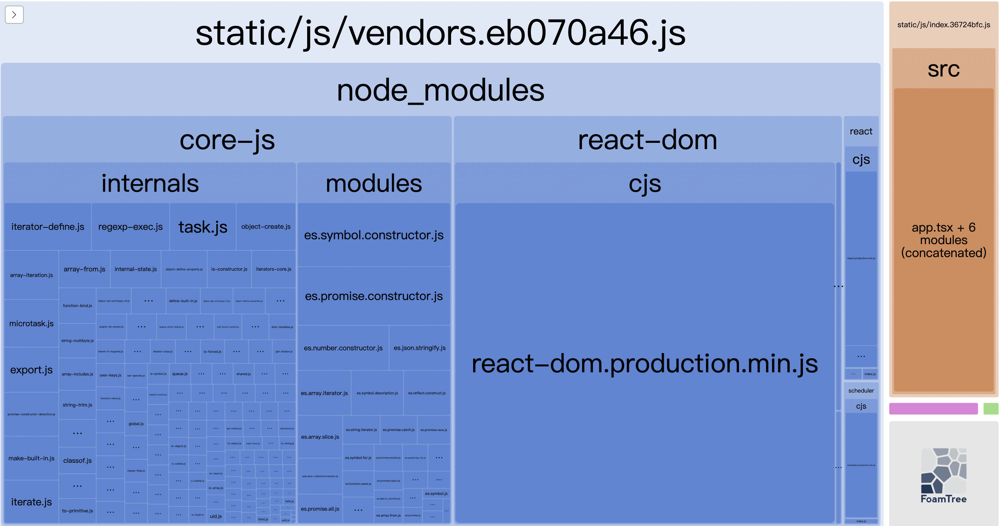

---
nav:
  title: 博客
  order: 2
group:
  title: 前端工程化
  order: 1
title: 优化构建结果
description: 优化构建结果
order: 4
---

### 1. webpack包分析工具
`webpack-bundle-analyzer`是分析webpack打包后文件的插件,使用交互式可缩放树形图可视化 webpack 输出文件的大小。通过该插件可以对打包后的文件进行观察和分析,可以方便我们对不完美的地方针对性的优化。
```
yarn add webpack-bundle-analyzer -D
```
修改 __webpack.analy.js__
```
const commonConfig = require('./webpack.common'); // 引入打包配置
const SpeedMeasurePlugin = require('speed-measure-webpack-plugin'); // 引入webpack打包速度分析插件
const { BundleAnalyzerPlugin } = require('webpack-bundle-analyzer'); // 引入分析打包结果插件
const { merge } = require('webpack-merge'); // 引入合并webpack配置方法

const smp = new SpeedMeasurePlugin(); // 实例化分析插件

// 使用smp.wrap方法,把生产环境配置传进去,由于后面可能会加分析配置,所以先留出合并空位
module.exports = smp.wrap(
  merge(commonConfig, {
    plugins: [
      new BundleAnalyzerPlugin() // 配置分析打包结果插件
    ]
  })
);
```
配置好后,执行 `yarn run build:analy`命令,打包完成后浏览器会自动打开窗口,可以看到打包文件的分析结果页面,可以看到各个文件所占的资源大小。

### 2. 抽取css样式文件
在生产环境我们希望把css单独抽离出来,方便配置缓存策略。而插件`mini-css-extract-plugin`就是来帮我们做这件事。
```
yarn add mini-css-extract-plugin -D
```
修改 __webpack.common.js__, 根据环境变量设置开发环境使用`style-looader`还是打包模式抽离css。
```
// webpack.common.js
const commonConfig = {
  // ...
  module: {
    rules: [
      // ...
      {
        test: /.less$/, //匹配 css和less 文件
        use: [
          // 4.将解析后的css 插入到头部style标签中(做了样式的热替换功能)
          style-loader'
          // 3.解析css 为浏览器可以识别的。 开启cssModule， @import 的css文件也通过后面2个loader的处理
          { loader: 'css-loader', options: { modules: true, importLoaders: 2 } },
          // 2. 给css 添加兼容浏览器的前缀
          'postcss-loader',
          // 1.将less 解析为css
          'less-loader'
        ]
      },
    ]
  }
}
```
在打包的时候加入`mini-css-extract-plugin` 插件配置。
```
const path = require('path')
const MiniCssExtractPlugin = require('mini-css-extract-plugin')

const generatorPlugin = configs => {
    const plugins = [ // ... ];
    if (isProd) {
    plugins.push(
       new MiniCssExtractPlugin({
        filename: 'static/css/[name].css' // 抽离css的输出目录和名称
      }),
    );
  }
  return plugins;
}
```
配置完成后,在开发模式css会嵌入到style标签里面,方便样式热替换,打包时会把css抽离成单独的css文件。
### 3. 压缩css文件
通过`css-minimizer-webpack-plugin`来压缩css。
修改 __webpack.prod.js__ 文件， 需要在优化项`optimization.minimizer`属性中配置。
```
// webpack.prod.js
// ...
const CssMinimizerPlugin = require('css-minimizer-webpack-plugin')
const prodConfig = {
  // ...
  optimization: {
    minimizer: [
      new CssMinimizerPlugin(), // 压缩css
    ],
  },
}
```
再次执行打包就可以看到css已经被压缩了。
### 4. 压缩js文件
设置mode为production时,webpack会使用内置插件`terser-webpack-plugin`压缩js文件,该插件默认支持多线程压缩,但是上面配置`optimization.minimizer`压缩css后,js压缩就失效了,需要手动再添加一下。
```
yarn add terser-webpack-plugin -D
```
修改 __webpack.prod.js__ 文件。
```
const TerserPlugin = require('terser-webpack-plugin')
const prodConfig = {
  // ...
  optimization: {
    minimizer: [
      // ...
      new TerserPlugin({ // 压缩js
        parallel: true, // 开启多线程压缩
        terserOptions: {
          compress: {
            pure_funcs: ["console.log"] // 删除console.log
          }
        }
      }),
    ],
  },
}
```
配置完成后再打包,css和js就都可以被压缩了。
### 5. 合理配置打包文件hash
合理配置hash,利用浏览器缓存来提升前端加载页面速度和减少服务器压力。
webpack打包的hash分三种：
* `hash`：跟整个项目的构建相关,只要项目里有文件更改,整个项目构建的hash值都会更改,并且全部文件都共用相同的hash值。
* `chunkhash`：不同的入口文件进行依赖文件解析、构建对应的chunk,生成对应的哈希值,文件本身修改或者依赖文件修改,chunkhash值会变化。
* `contenthash`：每个文件自己单独的 hash 值,文件的改动只会影响自身的 hash 值。

hash是在输出文件时配置的,格式是filename: "[name].[chunkhash:8][ext]",[xx] 格式是webpack提供的占位符, :8是生成hash的长度。
* `ext`:	文件后缀名
* `name`:	文件名
* `path`:	文件相对路径
* `folder`:	文件所在文件夹
* `hash`:	每次构建生成的唯一 hash 值
* `chunkhash`:	根据 chunk 生成 hash 值
* `contenthash`:	根据文件内容生成 hash 值

我们在生产环境里会把js中一些公共库和程序入口文件区分开,单独打包构建,采用chunkhash的方式生成哈希值,只要我们不改动公共库的代码,就可以保证其哈希值不变,可以继续使用浏览器缓存,所以js适合使用chunkhash。

css和图片资源媒体资源一般都是单独存在的,可以采用contenthash,只有文件本身变化后会生成新hash值。

修改 __webpack.common.js__,把js输出的文件名称格式加上chunkhash,把css和图片媒体资源输出格式加上contenthash
```
// webpack.common.js
// ...
const commonConfig = {
  // 打包文件出口
  output: {
    filename: 'static/js/[name].[chunkhash:8].js', // // 加上[chunkhash:8]
    // ...
  },
  module: {
    rules: [
      {
        test:/.(png|jpg|jpeg|gif|svg)$/, // 匹配图片文件
        // ...
        generator:{ 
          filename:'static/images/[name].[contenthash:8][ext]' // 加上[contenthash:8]
        },
      },
      {
        test:/.(woff2?|eot|ttf|otf)$/, // 匹配字体文件
        // ...
        generator:{ 
          filename:'static/fonts/[name].[contenthash:8][ext]', // 加上[contenthash:8]
        },
      },
      {
        test:/.(mp4|webm|ogg|mp3|wav|flac|aac)$/, // 匹配媒体文件
        // ...
        generator:{ 
          filename:'static/media/[name].[contenthash:8][ext]', // 加上[contenthash:8]
        },
      },
    ]
  },
  // ...
}
```
再修改 __webpack.prod.js__,修改抽离css文件名称格式
```
// webpack.prod.js
// ...
const MiniCssExtractPlugin = require('mini-css-extract-plugin')
const prodConfig = {
  plugins: [
    // 抽离css插件
    new MiniCssExtractPlugin({
      filename: 'static/css/[name].[contenthash:8].css' // 加上[contenthash:8]
    }),
    // ...
  ],
  // ...
}
```
再次打包就可以看到文件后面的hash了
### 6. 代码分割第三方包和公共模块
代码分割通过`splitChunks`配置（有默认配置）,(按需加载或是并行加载)
* 第一种：（防止重复，使用splitChunksPlugin 去重和分离chunk）同步代码分割，配置以下配置，会分析将代码中该提出的内容提出到一个文件单独存放
* 第二种: （动态导入）异步代码分割，使用splitChunks 默认配置，如通过import().then(); 异步加载的库也会放入到单独一个文件中
* 第三种：（入口起点）使用entry配置手动地分离代码

在实际项目中，代码分割可以参考如下分离原则：
* 1.业务代码和第三方依赖分离
* 2.业务代码，业务公共代码和第三方依赖分离
* 3.首次加载和访问后加载的代码分离

因为第三方包改变的几率比较小，所以可以单独把node_modules中的代码单独打包，有效利用浏览器缓存。也可以包公共模块提取出来，避免重复打包加大代码体积。
```
// webpack.prod.js
const prodConfig = {
  optimization: {
    splitChunks: {
      /**
       * chunks
       * all: 支持同步和异步的代码分割。async：只支持异步代码分割。 iniitial: 只支持同步代码分割，同步代码分割还要设置cacheGroups.vendors,将打包文件放入vendors组里面
       * 可以只设置该项，其他用默认设置
       */
      chunks: 'all', // 默认async
      minSize: 30000, // 当文件，库或是模块大小大于30000kb 才做代码分割
      maxSize: 1000000, // 对大的文件进行再一次分割（一般不配置）
      /**
       * 以lodash.js 为例
       * webpack打包后在生成很多chunk文件（js文件），如果有n个以上的文件需要依赖lodash.js，那么lodash就需要代码分割，生成单独文件,
       * 如果这么多chunk文件里面只有一个需要依赖lodash.js， 则该文件不做代码分割
       */
      minChunks: 1, // 包被引用几次以上才会被分割
      maxAsyncRequests: 5, // 同时加载的模块数是5个， 在打包前5个库的时候会生成5个文件，如果是操过5个，则不会在做代码分割
      maxInitialRequests: 3, // 整个网站首页启动，入口文件加载时引入的库最多分割出3个文件，如果超过3个就不会做代码分割
      automaticNameDelimiter: '~', // 分割文件生成时，文件名中组和入口文件的连接符
      // name: true, // 打包生成的文件名用cacheGroups的设置
      // 同步代码分割要走cacheGroups（缓存组）将所有符合不同缓存组的文件打包到不同的文件里
      cacheGroups: {
        /**
         * 同步代码分割，如果发现该文件是从node_modules里面引入的，则会把该文件打包单独放入vendors.js文件里（集合）
         * 设置为false, 则可以删除打包文件名字前面的vendors
         * 如果一个文件符合所有组的话，则该文件打包到priority值大的组里面
         */
        vendors: {
          test: /[\\/]node_modules[\\/]/,
          priority: -10,
          name: 'vendors' // 设置打包文件名
        },
        /**
         * 同步代码分割不在node_modules 引入的文件的默认分割文件配置
         * default~main.js 表示该文件属于default这组，入口文件是main.js
         */
        default: {
          minChunks: 2, // 使用两次就提取出来
          priority: -20,
          chunks: 'initial', //  // 只提取初始化就能获取到的模块,不管异步的
          // 如果一个模块已经打包过了，当该模块被其他模块引用，其他模块打包时就会忽略该模块，不会重复打包了，而是使用之前打包的那个模块
          // reuseExistingChunk: true,
          minSize: 0, // 提取代码体积大于0就提取出来
          name: 'common'
        }
      }
    }
  } 
}
```
### 7. tree-shaking清理未引用js
tree shaking(摇树优化)
* 将模块中引入的内容打包，没有引入的给忽略，摇掉（不打包进代码，优化文件大小）
* 只支持es module 方式的引入（静态引入的方式）(依赖于ESModule 模块系统的静态结构特性，其他模块系统不支持)
* 在mode：development 模式下需要设置以下配置usedExports: true, production 模式下可以不配置
* 针对模块中需要引入但是没有导出内容的模块（import './style.scss'），tree shaking会认为该模块没有导出，引用内容，自动忽略掉，因此我们需要在package.json 里面配置 "sideEffects": ['./*.scss'],使该文件不使用tree shaking 打包，以免代码出现问题，没有则设置为false
* developmen 模式下，不引用的代码也会打包入文件中，是因为要调试，如果删除代码，则source map对应的行数就会不正确。但是文件会注明使用了哪些内容。production模式下不引用的代码就不会打包入文件
     

### 8. tree-shaking清理未使用css
js中会有未使用到的代码,css中也会有未被页面使用到的样式,可以通过`purgecss-webpack-plugin`插件打包的时候移除未使用到的css样式,这个插件是和`mini-css-extract-plugin`插件配合使用的,在上面已经安装过,还需要`glob-all`来选择要检测哪些文件里面的类名和id还有标签名称,
```
yarn add purgecss-webpack-plugin glob-all -D
```
修改 __webpack.common.js__
```
const globAll = require('glob-all')
const PurgeCSSPlugin = require('purgecss-webpack-plugin')
const MiniCssExtractPlugin = require('mini-css-extract-plugin')

const generatorPlugin = configs => {
    const plugins = [ // ... ];
    if (isProd) {
      plugins.push(
        // 抽离css插件
        new MiniCssExtractPlugin({
          filename: 'static/css/[name].[contenthash:8].css' // 抽离css的输出目录和名称
        }),
        // 清理无用css
        new PurgeCSSPlugin({
          // 检测src下所有tsx文件和index.html中使用的类名和id和标签名称
          // 只打包这些文件中用到的样式
          paths: globAll.sync([
          `${path.join(__dirname, '../src')}/**/*.tsx`,
              path.join(__dirname, '../index.html')
          ], {
          nodir: true
        }),
        defaultExtractor: content => content.match(/[\w-/:]+(?<!:)/g) || [],
          // 设置白名单safelist
          afelist: {
            standard: [/^ant-/] // 过滤以ant-开头的类名，哪怕没用到也不删除
          }
        }),
      );
  }
  return plugins;
}
```
这个代码里测试没成功，不知道哪里配置有问题。
### 9. 资源懒加载
其实加载一个页面的时候只需要公共资源和当前页面的资源就可以了,其他页面资源可以等使用到的时候再加载,可以有效提升首屏加载速度。
webpack默认支持资源懒加载,只需要引入资源使用import语法来引入资源,webpack打包的时候就会自动打包为单独的资源文件,等使用到的时候动态加载。


### 10. 资源预加载
上面配置了资源懒加载后,虽然提升了首屏渲染速度,但是加载到资源的时候会有一个去请求资源的延时,如果资源比较大会出现延迟卡顿现象,可以借助link标签的rel属性prefetch与preload,link标签除了加载css之外也可以加载js资源,设置rel属性可以规定link提前加载资源,但是加载资源后不执行,等用到了再执行。
rel的属性值
* `preload`:页面必定需要的资源,浏览器一定会加载这些资源。
* `prefetch`: 页面可能需要的资源,浏览器可以在空闲时加载这些资源。
对于当前页面很有必要的资源使用 __preload__ ,对于可能在将来的页面中使用的资源使用 __prefetch__。

在import引入动态资源时使用webpack的魔法注释,来设置__预获取__和__预加载__。
```
// 单个目标
import(
  /* webpackChunkName: "my-chunk-name" */ // 资源打包后的文件chunkname
  /* webpackPrefetch: true */ // 开启prefetch预获取
  /* webpackPreload: true */ // 开启preload预获取
  './module'
);
```
### 11. 打包时生成gzip文件
前端代码在浏览器运行,需要从服务器把html,css,js资源下载执行,下载的资源体积越小,页面加载速度就会越快。一般会采用gzip压缩,现在大部分浏览器和服务器都支持gzip,可以有效减少静态资源文件大小,压缩率在 70% 左右。
nginx可以配置gzip: on来开启压缩,但是只在nginx层面开启,会在每次请求资源时都对资源进行压缩,压缩文件会需要时间和占用服务器cpu资源，更好的方式是前端在打包的时候直接生成gzip资源,服务器接收到请求,可以直接把对应压缩好的gzip文件返回给浏览器,节省时间和cpu。

webpack可以借助`compression-webpack-plugin` 插件在打包时生成 gzip 文章。
```
yarn add compression-webpack-plugin -D
```
```
const CompressionPlugin  = require('compression-webpack-plugin')

const generatorPlugin = configs => {
    const plugins = [ // ... ];
    if (isProd) {
    plugins.push(
      new CompressionPlugin({
        test: /.(js|css)$/, // 只生成css,js压缩文件
        filename: '[path][base].gz', // 文件命名
        algorithm: 'gzip', // 压缩格式,默认是gzip
        test: /.(js|css)$/, // 只生成css,js压缩文件
        threshold: 10240, // 只有大小大于该值的资源会被处理。默认值是 10k
        minRatio: 0.8 // 压缩率,默认值是 0.8
      })
    );
  }
  return plugins;
}
```
配置完成后再打包,可以看到打包后js的目录下多了一个 .gz 结尾的文件。

