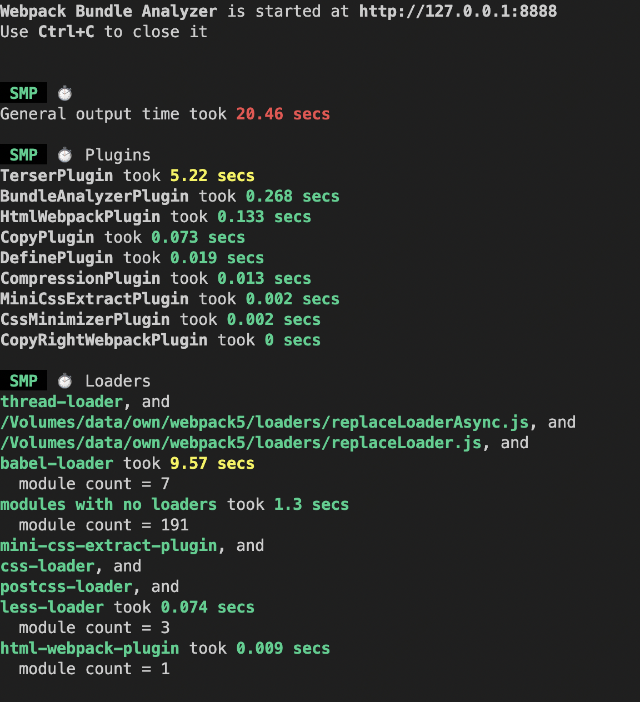

---
nav:
  title: 博客
  order: 2
group:
  title: 前端工程化
  order: 1
title: 优化构建速度
description: 优化构建速度
order: 3
---

### 1. 构建耗时分析
当进行优化的时候,肯定要先知道时间都花费在哪些步骤上了,而speed-measure-webpack-plugin插件可以帮我们做到,安装依赖：
```
yarn add speed-measure-webpack-plugin -D
```
使用的时候为了不影响到正常的开发/打包模式,我们选择新建一个配置文件,新增webpack构建分析配置文件 __config/webpack.analy.js__。
```
const commonConfig = require('./webpack.common'); // 引入打包配置
const SpeedMeasurePlugin = require('speed-measure-webpack-plugin'); // 引入webpack打包速度分析插件
const { merge } = require('webpack-merge'); // 引入合并webpack配置方法

const smp = new SpeedMeasurePlugin(); // 实例化分析插件

// 使用smp.wrap方法,把生产环境配置传进去,由于后面可能会加分析配置,所以先留出合并空位
module.exports = smp.wrap(
  merge(commonConfig, {})
);
```
修改 __package.json__ 添加启动webpack打包分析脚本命令,在scripts新增：
```
{
  // ...
  "scripts": {
    // ...
    "build:analy": "cross-env NODE_ENV=production BASE_ENV=prod webpack -c config/webpack.analy.js",
  }
  // ...
}
```
执行 `yarn run build:analy`命令,便看到每个阶段的耗时时间。在真正的项目中可以通过这个来分析打包时间花费在什么地方,然后来针对性的优化。

### 2. 开启持久化存储缓存
在webpack5之前做缓存是使用`babel-loader`缓存js的解析结果,`cache-loader`缓存css等资源的解析结果,还有模块缓存插件`hard-source-webpack-plugin`,配置好缓存后第二次打包,通过对文件做哈希对比来验证文件前后是否一致,如果一致则采用上一次的缓存,可以极大地节省时间。
通过配置 webpack5 持久化缓存,来缓存生成的 webpack 模块和 chunk,改善下一次打包的构建速度,可提速 90% 左右。修改 __webpack.common.js__ 。
```
// webpack.common.js
const commonConfig = {
  // ...
  cache: {
    type: 'filesystem', // 使用文件缓存
  },
}
```
默认缓存在内存中，可以设置缓存到硬盘里，缓存的存储位置在node_modules/.cache/webpack,里面又区分了development和production缓存。
### 3. 开启多线程loader
webpack的loader默认在单线程执行,现代电脑一般都有多核cpu,可以借助多核cpu开启多线程loader解析,可以极大地提升loader解析的速度,通过`thread-loader`开启多进程解析loader。
```
yarn add thread-loader -D
```
使用时,需将此 loader 放置在其他 loader 之前。放置在此 loader 之后的 loader 会在一个独立的 worker 池中运行。
```
// webpack.common.js
const commonConfig = {
  // ...
  module: {
    rules: [
      {
        test: /.(ts|tsx)$/,
        use: ['thread-loader', 'babel-loader']
      }
    ]
  }
}
```
由于`thread-loader`不支持抽离css插件 `MiniCssExtractPlugin.loader`(下面会讲),所以这里只配置了多进程解析js,开启多线程也是需要启动时间,大约600ms左右,所以适合规模比较大的项目。
### 4. 配置alias别名
webpack支持设置别名alias,设置别名可以让后续引用的地方减少路径的复杂度。
修改webpack.common.js
```
// webpack.common.js
const commonConfig = {
  // ...
   resolve: {
    // ...
    alias: {
      '@': path.join(__dirname, '../src')
    }
  }
}
```
修改 __tsconfig.json__,添加baseUrl和paths。
```
{
  "compilerOptions": {
    // ...
    "baseUrl": ".",
    "paths": {
      "@/*": [
        "src/*"
      ]
    }
  }
}
```
配置修改完成后,在项目中使用 @/xxx.xx,就会指向项目中src/xxx.xx,在js/ts文件和css文件中都可以用。
### 5. 缩小loader作用范围
一般第三库都是已经处理好的,不需要再次使用loader去解析,可以按照实际情况合理配置loader的作用范围,来减少不必要的loader解析,节省时间,通过使用 include和exclude 两个配置项,可以实现这个功能,常见的例如：

* `include`：只解析该选项配置的模块
* `exclude`：不解该选项配置的模块,优先级更高
```
// webpack.common.js
const commonConfig = {
  // ...
  module: {
    rules: [
      {
        test: /.(ts|tsx)$/,
        use: ['thread-loader', 'babel-loader'],
        include: [path.resolve(__dirname, '../src')], 只对项目src文件的ts,tsx进行loader解析
      }
    ]
  }
}
```
如果除src文件外也还有需要解析的,就把对应的目录地址加上就可以了。
### 6. 精确使用loader
webpack构建模块依赖关系引入新文件时，会根据文件后缀来倒序遍历rules数组，如果文件后缀和test正则匹配到了，就会使用该rule中配置的loader依次对文件源代码进行处理，最终拿到处理后的sourceCode结果，可以通过避免使用无用的loader解析来提升构建速度，比如使用`less-loader`解析css文件。
ts和tsx也是如此，ts里面是不能写jsx语法的，所以可以尽可能避免使用 @babel/preset-react对 .ts 文件语法做处理。
### 7. 缩小模块搜索范围
node里面模块有三种
* node核心模块
* node_modules模块
* 自定义文件模块
使用require和import引入模块时如果有准确的相对或者绝对路径,就会去按路径查询,如果引入的模块没有路径,会优先查询node核心模块,如果没有找到会去当前目录下node_modules中寻找,如果没有找到会查从父级文件夹查找node_modules,一直查到系统node全局模块。

这样会有两个问题,一个是当前项目没有安装某个依赖,但是上一级目录下node_modules或者全局模块有安装,就也会引入成功,但是部署到服务器时可能就会找不到造成报错,另一个问题就是一级一级查询比较消耗时间。可以告诉webpack搜索目录范围,来规避这两个问题。
```
// webpack.common.js
const path = require('path')
const commonConfig = {
  // ...
  resolve: {
     // ...
     modules: [path.resolve(__dirname, '../node_modules')], // 查找第三方模块只在本项目的node_modules中查找
  },
}
```
### 8. devtool 配置
source map 为源码和打包后文件的映射,便于查找源文件中错误代码的位置。不同的映射模式会明显影响到构建和重新构建的速度, devtool是配置源码映射方式的。
>devtool的命名规则为 `^(inline-|hidden-|eval-)?(nosources-)?(cheap-(module-)?)?source-map$`

* inline-: 将source map 打包到js文件中，通过dataUrl 形式引入
* hidden-: 生成SourceMap 文件，但不使用
* eval-: 打包速度最快，性能最好的模式，以eval的方式生成对应关系，通过dataUrl 形式引入
* nosources-: 不生成SourceMap
* cheap-：错误代码仅提示到行，不会到列，只管业务代码的映射（提高打包性能）
* module-: 还要管第三方模块和loader里面的错误，展示源码中的错误位置
* source-map： 生成单独source map文件

开发环境推荐：`eval-cheap-module-source-map`
打包环境推荐：`none`(就是不配置devtool选项了，不是配置devtool: 'none')(none话调试只能看到编译后的代码,也不会泄露源代码,打包速度也会比较快。)
```
// webpack.common.js
const commonConfig = {
  // ...
  devtool: 'eval-cheap-module-source-map'
}
```
### 9. 其他优化配置
* `externals`: 外包拓展，打包时会忽略配置的依赖，会从上下文中寻找对应变量
将第三方模块改为 CDN 引入。
  1.在html 中引入
  2.在extenals 中配置需要排除的包
  3.客户端会缓存这些资源，提升应用加载速度。
  4.这些依赖不会参与构建过程(不会被打包进输出文件中), 可以提升构建速度。
* `module.noParse`: 匹配到设置的模块,将不进行依赖解析，适合jquery,boostrap这类不依赖外部模块的包
* `ignorePlugin`: 可以使用正则忽略一部分文件，常在使用多语言的包时可以把非中文语言包过滤掉


