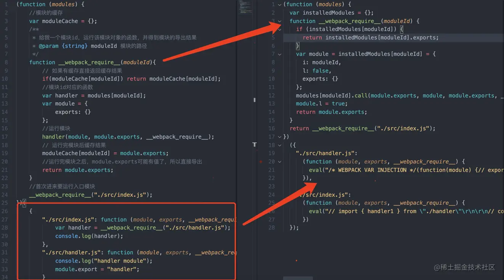
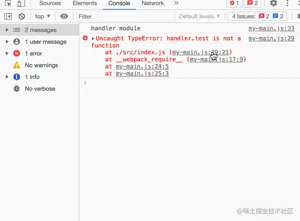

我们来分析一下经过webpack打包后的文件它的内部实现原理到底是怎样的。本文解析使用的是4.x版本的打包结果，我观察了5.x的打包结果，总体思想上大同小异。
### 新建文件
现有两个文件，一个为入口文件src/index.js，一个为src/handler.js。index依赖了handler。我们来看一下经过webpack打包出来的文件到底是啥样的。
乍一看我们可能两眼一抹黑，一大堆东西理解起来非常困难，那么尝试换个角度，我们能不能先自己手写实现一下呢？如果让你设计一个
webpack你会怎么处理多个文件最后合并到一个文件中呢。接下来，我们一步一步按照自己的理解手写出来，最后再对比一下正宗的打包结果看看。
```
//index.js
var handler = require("./handler");
console.log(handler);
```
```
//handler.js
console.log("handler module");
module.export = "handler";
```
### 手写实现打包结果
> 第一步：我们需要考虑的是如何将index和handler合并到一个文件中，并且不能污染全局变量。我们都知道在最终的打包结果中，不存在任何CommonJs的语法和ES Module的语法。webpack打包过程是在node环境中运行的，所以它遵循的是CommonJs的规范。
在CommonJS规范中，每一个模块运行都是将其放到一个函数环境中运行，所以我们运行某个模块实际上是在运行一个函数。我们首先可以将每个模块的代码放入到一个函数中运行。
```
//该对象保存了所有的模块和对应的代码
var modules = {
    "./src/index.js": function (module, exports, require) {
        var handler = require("./src/handler.js");
        console.log(handler);
    },
    "./src/handler.js": function (module, exports, require) {
        console.log("handler module");
        module.export = "handler";
    }
}
```
这不还是定义了一个modules污染全局变量了吗？伞兵作者？别着急，还没改造呢。我们来看一下这一步做了哪些操作，我们将模块的路径作为key，将对应的代码放到一个函数中，这样就不会污染全局变量了。但是模块里会用到module、exports、require等关键字，这些都是CommonJs规范里的东西，在最终的打包文件中肯定没办法直接使用，所以我们可以通过函数的参数传递进去，那么究竟是谁传？先别着急下面都会讲到。
> 第二步：打包过程肯定要先运行入口文件，然后根据入口文件来寻找依赖。我们可以通过一个函数来处理modules对象，在函数中执行入口文件并得到模块导出结果，如何执行入口文件？还要实现一个require函数，此函数的功能就是根据模块id运行一个模块。
```
(function (modules) {
    //模块的缓存
    var moduleCache = {};  

    /**
     * 给我一个模块id，运行该模块对象的函数，并得到模块的导出结果
     * @param {string} moduleId 模块的路径
     */
    function __webpack_require__(moduleId){
        
        // 如果有缓存直接返回缓存结果
        if(moduleCache[moduleId]) return moduleCache[moduleId];

        //模块id对应的函数
        var handler = modules[moduleId];  

        var module = {
            exports: {}
        };

        //运行模块
        handler(module, module.exports, __webpack_require__);   

        // 运行完模块后缓存结果
        moduleCache[moduleId] = module.exports;

        //运行完模块之后，module.exports可能有值了，所以直接导出
        return module.exports;  
    }

    //首次进来要运行入口模块，得到模块返回结果去做一些事情
    return __webpack_require__("./src/index.js");  
})(
    {
        "./src/index.js": function (module, exports, __webpack_require__) {
            var handler = __webpack_require__("./src/handler.js");
            console.log(handler);
        },
        "./src/handler.js": function (module, exports, __webpack_require__) {
            console.log("handler module");
            module.export = "handler";
        }
    }
)
```
我们定义了一个立即执行函数，然后将前面的modules通过参数的形式直接传给匿名函数，这样就达到了不污染任何全局变量的目的。然后通过require运行了入口文件，为了防止跟node环境下的require重名，所以改用__webpack_require__命名，首先检查是否有缓存，如果有缓存则直接返回上一次的缓存结果。如果没有缓存则先找到moduleId对应的函数。
然后运行函数，将定义的module对象当参数传入，运行完后将module.exports当作缓存结果保存。这就是为什么在node中你如果使用了exports导出，但最后如果将modules.exports改变了引用，你的导出结果都将失效的原因。
此时我们可以再回过头来看下webpack的打包结果跟我们手写的打包结果有什么不同。先将其一些注释和适配其他模块化的代码删掉。

从图中可以看到实现的思路是一摸一样的，都是使用匿名函数将模块作为参数传递进去。然后实现自己的__webpack_require__函数，唯一不同的是它的缓存是用了三个key来表示，i代表模块的id，l代表模块是否加载过。exports就跟我们写的作用一样。唯一不同的就是它将模块的代码放入到eval中执行。
为什么要使用eval？因为我们最终要运行的代码是打包出来的文件，如果我们写了一段错误的代码打包到最终结果中，那么是不方便我们调试的。比如调用了handler上不存在的一个方法。

如果报错的话，点错误信息进去是打包后的文件，不利于我们调试，但是用了eval可以将代码放到单独的一个环境中执行，不会有其他代码进行干扰。同样的，还可以设置报错的文件位置sourceURL更加方便的利于我们调试。

