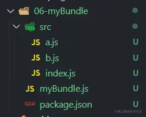

###  运行流程
webpack运行流程是串行方式的，大致如下：
1. 初始化参数：从配置文件和 Shell 语句中读取与合并参数配置，得出最终的参数配置；
2. 开始编译：用上一步得到的参数配置初始化 Compiler 对象，加载所有配置的插件，执行对象的 run 方法开始执行编译；
3. 确定入口：根据配置中的 entry 找出所有的入口文件；
4. 编译模块：从入口文件出发，调用所有配置的 Loader 对模块进行翻译，再找出该模块依赖的模块，再递归本步骤。直到所有入口依赖的文件都经过了本步骤的处理；
5. 完成模块编译：在经过第4步使用 Loader 翻译完所有模块后，得到了每个模块被翻译后的最终内容以及它们之间的依赖关系；
6. 输出资源：根据入口和模块之间的依赖关系，组装成一个个包含多个模块的 Chunk，再把每个 Chunk 转换成一个单独的文件加入到输出列表，这步是可以修改输出内容的最后机会；
7. 输出完成：在确定好输出内容后，根据配置确定输出的路径和文件名，把文件内容写入到文件系统。

提示：在以上的过程中，webpack会在特定的时机广播出对应的事件，方便触发插件中监听了这些事件的钩子运行。

看似流程较多，我们可以精简一下：
1. 初始化：启动构建，读取与合并配置参数，加载 Plugin，实例化 Compiler。
2. 编译：从 Entry 发出，针对每个 Module 串行调用对应的 Loader 去翻译文件内容，再找到该 Module 依赖的 Module，递归地进行3. 编译处理。
输出：对编译后的 Module 组合成 Chunk，把 Chunk 转换成文件，输出到文件系统。


### 实现一个简单的webpack
俗话说：读万卷书不如行万里路，讲再多的原理都不如敲敲代码来得实在。下面我们就一步一步实现一个简单的打包器。
准备工作
创建一个项目，包含如下文件及文件夹：

```
// /src/index.js
import a from './a.js';

console.log(a);
```
```
// /src/a.js
import b from './b.js';
const a = `b content: ${b}`;
export default a;
```
```
// /src/b.js
const b = 'Im B';
export default b;
```
现在这样的代码在不支持ESModule的浏览器是不能运行的，需要使用打包器进行转换才行，马上开撸。

#### 实现模块打包
在开撸前，我们明确下打包的目标和流程：
1. 找到项目入口（即/src/index.js），并读取其内容；
2. 分析入口文件内容，递归寻找其依赖，生成依赖关系图；
3. 根据生成的依赖关系图，编译并生成最终输出代码
__/myBundle.js__ 即为我们的打包器，所有相关的代码也将写在其中，下面开始吧！
1. 获取模块内容
读取入口文件的内容，这个很简单，我们创建一个方法getModuleInfo，使用fs来读取文件内容：
```
// myBundle.js
const fs = require('fs')
const getModuleInfo = file => {
    const content = fs.readFileSync(file, 'utf-8')
    console.log(content)
}
getModuleInfo('./src/index.js')
```
毫无疑问，这里会输出index.js文件的内容，不过它是一堆字符串，我们如何才能知道它依赖了哪些模块呢？有如下两种方式：
1. 正则：通过正则匹配'import'关键字来获取相应的文件路径，不过太麻烦了，还不可靠，万一代码里面有个字符串也有这些内容呢？
2. babel：可以通过
`@babel/parser`来将代码转换成AST（抽象语法树，Abstract Syntax Tree, 简称AST），再来分析AST查找依赖。看起来这种比较靠谱。
毫无疑问，使用第二种方式。
```
npm i @babel/parser ## 安装 @babel/parser
```
```
// myBundle.js
const fs = require('fs')
const parser = require('@babel/parser')
const getModuleInfo = file => {
    const content = fs.readFileSync(file, 'utf-8')
    const ast = parser.parse(content, {
       sourceType: 'module' // 解析ESModule须配置
    })
    console.log(ast)
    console.log(ast.program.body)
}
getModuleInfo('./src/index.js')
```
转换结果如下，可以看到一共两个节点，type属性标识了节点的类型，ImportDeclaration即对应了import语句，而其source.value即是引入模块的相对路径。想要的数据都有，是不是很赞！

2. 生成依赖关系表
有了上一步的数据，我们需要将它们生成一份结构化的依赖表，方便后续对代码处理。
其实就是遍历ast.program.body，将其中的ImportDeclaration类型的节点提取出来，并存入依赖表。
这里也不需要自己手动实现细节，直接使用`@babel/traverse`即可。
```
npm i  @babel/traverse ## 安装@babel/traverse
```
getModuleInfo方法做如下修改：
```
// myBundle.js
const fs = require('fs')
const path = require('path')
const parser = require('@babel/parser')
const traverse = require('@babel/traverse').default
const getModuleInfo = (file) => {
    const content = fs.readFileSync(file, 'utf-8');
    const ast = parser.parse(content, {
        sourceType: 'module'
    });
      const dependencies = {}; // 用于存储依赖
    traverse(ast, {
        ImportDeclaration({ node }) { // 只处理ImportDeclaration类型的节点
            const dirname = path.dirname(file);
            const newFile = '.'+ path.sep + path.join(dirname, node.source.value); // 此处将相对路径转化为绝对路径，
            dependencies[node.source.value] = newFile;
        }
      });
      console.log(dependencies);
};
getModuleInfo('./src/index.js')
```
输出结果如下：

接下来我们就可以返回一个完整的模块信息了。
在这里，我们顺便通过babel的工具（``@babel/core，@babel/preset-env`）将代码转换成ES5的语法。
```
npm i @babel/core @babel/preset-env ## 安装@babel/core @babel/preset-env
```
```
// myBundle.js
const fs = require('fs');
const path = require('path');
const parser = require('@babel/parser');
const traverse = require('@babel/traverse').default;
const babel = require('@babel/core');

const getModuleInfo = (file) => {
    const content = fs.readFileSync(file, 'utf-8');
    const ast = parser.parse(content, {
        sourceType: 'module'
  });
  const dependencies = {};
    traverse(ast, {
        ImportDeclaration({ node }) {
            const dirname = path.dirname(file);
            const newFile = '.'+ path.sep + path.join(dirname, node.source.value);
            dependencies[node.source.value] = newFile; // 使用文件相对路径为key，绝对路径为value
        }
  });
  const { code } = babel.transformFromAst(ast, null, {
        presets: ['@babel/preset-env']
  });
  const moduleInfo = { file, dependencies, code };
  console.log(moduleInfo);
    return moduleInfo;
};

getModuleInfo('./src/index.js');
```
输出如下

现在，模块的代码就已经转换成了一个对象，包含模块的绝对路径、依赖以及被babel转换后的代码，不过上面只处理了index.js的依赖，a.js的依赖并没有进行处理，所以并不是一份完整的依赖表，我们需要进一步处理。
其实也很简单，就是从入口开始，每个模块及其依赖都调用一下getModuleInfo方法进行分析，最终就会返回一个完整的依赖表(也有人叫依赖图，dependency graph)。
我们直接新写一个方法来处理：
```
// myBundle.js
const generDepsGraph = (entry) => {
    const entryModule = getModuleInfo(entry);
    const graphArray = [ entryModule ];
    for(let i = 0; i < graphArray.length; i++) {
        const item = graphArray[i];
        const { dependencies } = item;
        if(dependencies) {
            for(let j in dependencies) {
                graphArray.push(
                    getModuleInfo(dependencies[j])
                );
            }
        }
    }
    const graph = {};
    graphArray.forEach(item => {
        graph[item.file] = {
            dependencies: item.dependencies,
            code: item.code
        };
    });
    return graph;
};
```

现在，我们就生成一份完整的依赖表了，接下来，就可以根据这份数据来生成最终的代码了。
3. 生成输出代码
在生成代码前，我们先观察一下上面的代码，可以发现里面包含了export和require这样的commonjs的语法，而我们的运行环境（这里是浏览器）是不支持这种语法的，所以还需要自己来实现一下这两个方法。先贴上代码，再慢慢道来：
新建一个build方法，用来生成输出的代码。
```
// myBundle.js
const build = (entry) => {
    const graph = JSON.stringify(generDepsGraph(entry)); 
    return `
        (function(graph){
            function require(module) {                
                var exports = {};                
                return exports;
            };
            require('${entry}')
        })(${graph});
    `;
};

const code = build('./src/index.js');
```
说明：
* 第三行,JSON.stringify是将数据字符串化，否则在下面的立即执行函数中接收到的将是[object object]，因为下面是在字符串模板中使用，会发生类型转换。
* 返回的代码包裹在IIFE（立即执行函数）中是防止模块间作用域相互污染。
* require函数需要定义在输出的内容中，而不是当前的运行环境中，因为它会在生成的代码中执行。
接下来，我们需要拿到入口文件的code，并使用eval函数来执行它：
```
// myBundle.js
const build = (entry) => {
    const graph = JSON.stringify(generDepsGraph(entry));
    return `
        (function(graph){
            function require(module) {                
                var exports = {};
                (function(require, exports, code){
                    eval(code)
                })(require, exports, graph[module].code);
                return exports;
            };
            require('${entry}')
        })(${graph});
    `;
};

const code = build('./src/index.js');
console.log(code);
```
说明：
* 为了防止code中的代码和我们这里（return的字符串中）作用域有冲突，我们还是使用IIFE包裹，并将需要的参数传递进去。
* graph[module].code可以从上面的依赖表中获取到入口的代码。
输出如下：

这就是打包的成果了，不过先不要高兴过头了，这里还有一个大坑。
我们现在生成的代码中引入模块的方式都是基于'index.js'的相对路径，如果在其他模块引入的模块路径和相较于index.js不一致的时候，对应的模块就会找不到(路径不正确)，所以我们还要处理一下模块的路径。好在前面依赖表的dependencies属性里面记录了模块的绝对路径，只需要拿出来使用即可。
添加一个localRequire函数，用来从dependencies中获取模块绝对路径。
```
// myBundle.js
const build = (entry) => {
    const graph = JSON.stringify(generDepsGraph(entry));
    return `
        (function(graph){
            function require(module) {
                function localRequire(relativePath) {
                    return require(graph[module].dependencies[relativePath]);
                }
                var exports = {};
                (function(require, exports, code){
                    eval(code)
                })(localRequire, exports, graph[module].code);
                return exports;
            };
            require('${entry}')
        })(${graph});
    `;
};
```
接下来，将输出的代码写入到文件就可以了。
```
// myBundle.js
const code = build('./src/index.js')
fs.mkdirSync('./dist')
fs.writeFileSync('./dist/bundle.js', code)
```
最后，在html中引入一下，测试一下是否能够正常运行。没有疑问，肯定是可以正常运行的。
最后贴一下完整的代码：
```
// myBundle.js
const fs = require('fs');
const path = require('path');
const parser = require('@babel/parser');
const traverse = require('@babel/traverse').default;
const babel = require('@babel/core');

const getModuleInfo = (file) => {
    const content = fs.readFileSync(file, 'utf-8');
    const ast = parser.parse(content, {
        sourceType: 'module'
  });
  const dependencies = {};
    traverse(ast, {
        ImportDeclaration({ node }) {
            const dirname = path.dirname(file);
            const newFile = '.'+ path.sep + path.join(dirname, node.source.value);
            dependencies[node.source.value] = newFile;
        }
  });
  const { code } = babel.transformFromAst(ast, null, {
        presets: ['@babel/preset-env']
  });
  const moduleInfo = { file, dependencies, code };
    return moduleInfo;
};

const generDepsGraph = (entry) => {
    const entryModule = getModuleInfo(entry);
    const graphArray = [ entryModule ];
    for(let i = 0; i < graphArray.length; i++) {
        const item = graphArray[i];
        const { dependencies } = item;
        if(dependencies) {
            for(let j in dependencies) {
                graphArray.push(
                    getModuleInfo(dependencies[j])
                );
            }
        }
    }
    const graph = {};
    graphArray.forEach(item => {
        graph[item.file] = {
            dependencies: item.dependencies,
            code: item.code
        };
    });
    return graph;
};
const build = (entry) => {
    const graph = JSON.stringify(generDepsGraph(entry));
    return `
        (function(graph){
            function require(module) {
                function localRequire(relativePath) {
                    return require(graph[module].dependencies[relativePath]);
                }
                var exports = {};
                (function(require, exports, code){
                    eval(code)
                })(localRequire, exports, graph[module].code);
                return exports;
            };
            require('${entry}')
        })(${graph});
    `;
};

const code = build('./src/index.js');
fs.mkdirSync('./dist');
fs.writeFileSync('./dist/bundle.js', code);
```


